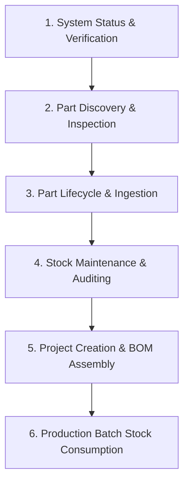

# Binner Domain & Workflow Guide

## 1. Standard End-to-End Workflow

### Step 1: Health & Connectivity Verification
- Call `get_system_status` to verify backend connectivity, retrieve the installed Binner version, and check inventory totals (parts count, total stock, valuation, low-stock count). Set `check_cloud=True` to test Binner Swarm cloud reachability.

### Step 2: Part Discovery & Inspection
- Search inventory using `list_parts` with query keywords, category paths/names, bin numbers, locations, package types, manufacturers, low-stock filters, or specific projected `fields` (e.g. `fields=['quantity', 'location', 'bin_number']`).
- Browse category hierarchy using `list_part_types` with lightweight node output (`id`, `name`, `children`). Restrict tree scope with `depth` (e.g. `depth=1` for top-level categories), `root_id`, or `root_name` to optimize LLM context footprint.
- Retrieve full component specifications, electrical parameters, KiCad symbol/footprint bindings, bin locations, and datasheets using `get_parts` with `part_numbers` or `part_ids`.

### Step 3: Part Lifecycle / Cataloging & Ingestion
- Create categories with `save_part_types` (`name`, optional `parent_part_type_id`, `description`).
- Persist new components into inventory with `save_parts`. Supports part numbers, quantities, packages, bin locations, unit costs, datasheet URLs, and category assignments (via overloaded `part_type` accepting numeric IDs or hierarchy paths like `Passives::Resistors::SMD`). Missing intermediate hierarchy nodes in new path strings are created automatically.

### Step 4: Stock Maintenance & Auditing
- Update absolute quantities, reorder thresholds, or storage bins via `save_parts`.
- Decommission obsolete or surplus stock in bulk via `delete_parts` (`part_numbers` or `part_ids`).
- Remove obsolete categories via `delete_part_types` (`part_type_ids` or `names`).

### Step 5: Project Lifecycle & BOM Assembly
- Initialize or update maker projects with `save_projects` (`name`, `description`, optional `project_id`, `archived`).
- Query maker projects via `list_projects` or `get_projects`.
- Allocate and edit BOM line items using `manage_bom_parts`, linking components with per-board required quantities, reference designators (e.g. `R1, R2, C1`), and optional simultaneous stock adjustments (`adjust_stock_delta`).
- Delete obsolete projects via `delete_projects` (`project_ids` or `names`).

### Step 6: Production Build & Stock Deduction
- Verify project readiness with `get_projects(project_ids=[...], include_bom=True)`.
- Execute batch assembly stock deduction via `consume_project_bom(project_id=..., build_quantity=N)`.
- Enforces an automated shortage circuit breaker: if on-hand stock is insufficient for any BOM item, zero mutations occur and a detailed shortage report is returned.

---

## 2. MCP Tool Directory

| Tool | Primary Parameters | Description |
| :--- | :--- | :--- |
| `get_system_status` | `check_cloud: bool = False` | Probe Binner connectivity, version, identity, and inventory statistics. |
| `list_parts` | `query`, `part_type`, `bin_number`, `location`, `package_type`, `manufacturer`, `low_stock_only`, `fields`, `page`, `limit`, `sort_by`, `direction` | Paginated component search with metadata filtering and field projection. |
| `get_parts` | `part_numbers: str[]`, `part_ids: int[]`, `fields: str[]` | Batch component inspection returning details, bin locations, and datasheets. |
| `save_parts` | `parts: PartSaveInput[]` | Batch create or update components with strict pre-flight validation. |
| `delete_parts` | `part_numbers: str[]`, `part_ids: int[]` | Batch component deletion by part number or ID. |
| `list_projects` | `query`, `page`, `limit`, `sort_by`, `direction` | Paginated search of maker projects. |
| `get_projects` | `project_ids: int[]`, `names: str[]`, `include_bom: bool = False` | Batch maker project retrieval with optional normalized BOM breakdown. |
| `save_projects` | `projects: ProjectSaveInput[]` | Batch create or update maker projects. |
| `delete_projects` | `project_ids: int[]`, `names: str[]` | Batch project deletion by ID or name. |
| `consume_project_bom` | `project_id: int`, `name: str`, `build_quantity: int = 1` | Deduct component stock for board unit assembly with shortage circuit breaker. |
| `list_part_types` | `depth`, `root_id`, `root_name`, `include_descriptions`, `include_part_counts` | Hierarchical category tree optimized for minimal LLM context usage. |
| `save_part_types` | `part_types: PartTypeSaveInput[]` | Batch create or update category nodes. |
| `delete_part_types` | `part_type_ids: int[]`, `names: str[]` | Batch category deletion by ID or name. |
| `manage_bom_parts` | `project_id: int`, `parts: BomPartInput[]` | Batch allocate, modify, or remove BOM line items for a project. |
| `lookup_cloud_parts` | `part_numbers: str[]` | Query Binner Swarm cloud for pinouts, package footprints, and datasheets. |

---

## 3. Structured Batch Input Schemas

All input models enforce **`extra="forbid"`** (`additionalProperties: false`). Any unknown fields or unexpected arguments are strictly rejected with descriptive validation errors.

### 3.1 `PartSaveInput` (`save_parts`)

Component record for batch inventory creation and updates.

| Field Name | Type | Default | Constraints & Description |
| :--- | :--- | :--- | :--- |
| `part_number` | `string` | **Required** | Unique component identifier / Manufacturer Part Number (MPN). Non-empty. |
| `part_type` | `string` \| `int` | `None` | Overloaded category identifier: hierarchy path (e.g. `"Passives::Resistors::SMD"`), leaf name (e.g. `"SMD"`), or numeric ID (`10` or `"10"`). |
| `part_type_id` | `int` \| `string` | `None` | Optional numeric category ID (accepted as fallback if `part_type` is omitted). |
| `quantity` | `int` \| `string` | `0` | Absolute count of physical units in stock ($\ge 0$). |
| `low_stock_threshold` | `int` \| `string` | `0` | Reorder alert threshold ($\ge 0$). |
| `cost` | `float` \| `string` | `0.0` | Unit purchase cost ($\ge 0.0$). |
| `currency` | `string` | `"USD"` | Currency code (e.g. `"USD"`, `"EUR"`). |
| `bin_number` | `string` | `None` | Primary storage bin / drawer identifier (e.g. `"A1-04"`, `"Drawer 12"`). |
| `bin_number2` | `string` | `None` | Secondary storage bin or sub-compartment label. |
| `location` | `string` | `None` | Physical storage location (room, cabinet, rack, or shelf name). |
| `package_type` | `string` | `None` | Component footprint / package (e.g. `"0805"`, `"SOIC-8"`). |
| `manufacturer` | `string` | `None` | Component manufacturer name. |
| `manufacturer_part_number` | `string` | `None` | Manufacturer internal part number if different from `part_number`. |
| `description` | `string` | `None` | Free-form technical description. |
| `datasheet_url` | `string` | `None` | Direct HTTP/HTTPS URL to component datasheet PDF. |
| `product_url` | `string` | `None` | Direct URL to distributor or supplier product web page. |
| `part_id` | `int` \| `string` | `None` | Database primary key of existing part. Explicitly passed for updates. |
| `create_only` | `bool` | `False` | If `True`, halts mutation with an error if the part already exists in inventory. |

### 3.2 `ProjectSaveInput` (`save_projects`)

Maker project record for batch persistence.

| Field Name | Type | Default | Constraints & Description |
| :--- | :--- | :--- | :--- |
| `name` | `string` | `None` | Project title. Required when creating a new project. |
| `project_id` | `int` | `None` | Numeric project ID. Required when updating an existing project without `name`. |
| `description` | `string` | `None` | Maker project description or documentation notes. |
| `archived` | `bool` | `False` | Soft-archive status of the project. |

### 3.3 `PartTypeSaveInput` (`save_part_types`)

Category hierarchy record for batch persistence.

| Field Name | Type | Default | Constraints & Description |
| :--- | :--- | :--- | :--- |
| `name` | `string` | `None` | Category name (e.g. `"Resistors"`). Required when creating a new category. |
| `part_type_id` | `int` | `None` | Numeric category ID. Required when updating an existing category with an ambiguous name. |
| `parent_part_type_id` | `int` | `None` | Parent category ID for hierarchical nesting (`null` or `0` for root categories). |
| `description` | `string` | `None` | Classification scope or description for this category node. |

### 3.4 `BomPartInput` (`manage_bom_parts`)

Bill of Materials line item operation record.

| Field Name | Type | Default | Constraints & Description |
| :--- | :--- | :--- | :--- |
| `part_number` | `string` | `None` | Inventory component part number. (Either `part_number` or `part_id` required). |
| `part_id` | `int` | `None` | Inventory component numeric ID. |
| `quantity` | `int` | `1` | Required units per board ($\ge 1$). |
| `reference_designator` | `string` | `None` | Silkscreen schematic designators (e.g. `"R1, R2, C5"`). |
| `notes` | `string` | `None` | Assembly notes or custom instructions for this line item. |
| `adjust_stock_delta` | `int` | `None` | Additive inventory stock adjustment applied simultaneously (`stock += delta`). |
| `remove` | `bool` | `False` | If `True`, removes this line item assignment from the project BOM. |

---

## 4. Domain Entity Models & Response Shapes

### 4.1 Component Entity (`PartResponse`)

| Field Name | Type | Description |
| :--- | :--- | :--- |
| `part_id` | `int` | Database primary key. |
| `part_number` | `string` | Unique component part number / MPN. |
| `quantity` | `int` | Absolute units on hand in inventory. |
| `low_stock_threshold` | `int` | Reorder threshold triggering low-stock alert when `quantity <= threshold`. |
| `cost` | `float` | Unit cost. |
| `currency` | `string` | Currency code (`"USD"`). |
| `bin_number` | `string` | Primary bin / drawer label. |
| `bin_number2` | `string` | Secondary compartment label. |
| `location` | `string` | Room, shelf, or cabinet name. |
| `package_type` | `string` | Footprint / package. |
| `part_type` | `string` | Resolved category hierarchy path. |
| `manufacturer` | `string` | Manufacturer name. |
| `manufacturer_part_number` | `string` | Manufacturer internal SKU. |
| `description` | `string` | Component description. |
| `datasheet_url` | `string` | Datasheet PDF link. |
| `product_url` | `string` | Supplier product page link. |
| `value` | `string` | Electrical component value (e.g. `"10k"`, `"0.1uF"`). |
| `symbol_name` | `string` | KiCad schematic symbol name. |
| `footprint_name` | `string` | KiCad PCB footprint name. |
| `mounting_type_id` | `int` | `0` (Unknown), `1` (SMD), `2` (THT). |
| `short_id` | `string` | Compact 10-character read-only identifier. |

### 4.2 Normalized BOM Line Item (`BomPartResponse`)

Delivered by `get_projects(include_bom=True)`:

| Field Name | Type | Description |
| :--- | :--- | :--- |
| `assignment_id` | `int` | Primary key of the project part assignment. |
| `part_id` | `int` | Inventory database part ID. |
| `part_number` | `string` | Component MPN / part number. |
| `quantity` | `int` | Required units per board assembly. |
| `reference_designator` | `string` | Schematic reference designators (e.g. `"R1, R2"`). |
| `stock_on_hand` | `int` | Physical count currently available in inventory. |
| `package_type` | `string` | Physical footprint / package. |

---

## 5. Operational Constraints & Validation Semantics

1. **Strict Unknown Argument & Field Rejection (`extra="forbid"`):**
   - Both top-level tool arguments and nested batch input records reject any unrecognized parameters with descriptive validation errors.
   - Prevents silent typos (e.g. sending `"qty"` instead of `"quantity"`) from causing unintended defaults or data loss.

2. **Pre-Flight Zero-Side-Effects Validation Policy:**
   - In `save_parts`, full batch validation runs before any mutation executes.
   - If ANY item contains invalid data (duplicate part numbers, negative quantities, invalid types, missing required names, or ambiguous category paths), execution halts immediately and **zero** database records are created or updated.

3. **Stock Quantity Semantics:**
   - `save_parts`: `quantity` sets the **absolute** on-hand inventory count.
   - `manage_bom_parts`: `adjust_stock_delta` applies an **additive delta** (`stock += delta`).
   - `consume_project_bom`: Decrements stock by `quantity_per_board * build_quantity`.

4. **BOM Shortage Circuit Breaker:**
   - `consume_project_bom` checks on-hand stock across all BOM items before executing deductions.
   - If stock is insufficient for any item, execution aborts, returns a shortage breakdown matrix, and leaves inventory untouched.

5. **Category Hierarchy Resolution & Ambiguity Safety:**
   - `part_type` accepts leaf names (`"SMD"`) or delimited paths (`"Passives::Resistors::SMD"`).
   - If a leaf name matches multiple categories, the mutation is rejected with candidate suggestions until disambiguated with a full path or numeric `part_type_id`.
   - Missing parent nodes in valid path strings are created automatically.

6. **Batch Mutation Fault Tolerance (Retry-Then-Report, Never Rollback):**
   - Transient network errors (502-504, connection timeouts) are retried once after a 3-second delay.
   - Non-transient errors (bad payloads, missing entities) fail immediately with 0 retries.
   - Partial successes are reported with failed items in `failed`, while successful items remain persistent.
