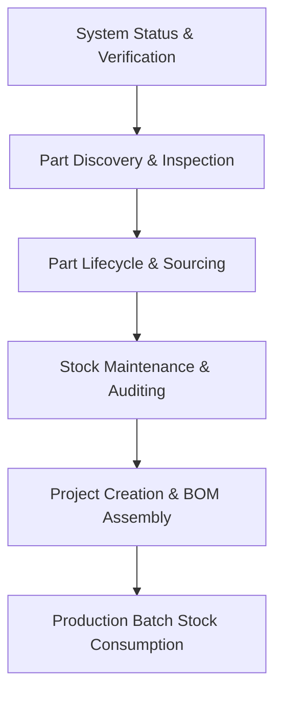

# Binner Domain & Workflow Guide

## 1. Standard End-to-End Workflow

### Step 1: Health & Connectivity Verification
- Call `get_system_status` to verify backend connectivity, retrieve the installed Binner version, and check global inventory metrics (total parts, valuation, low-stock count).

### Step 2: Part Discovery & Inspection
- Discover existing parts in local inventory using `list_parts` with query keywords, category path, bin number, location, package type, manufacturer, or low-stock filters.
- For deep technical evaluation, pass candidate identifiers (`part_ids` or `part_numbers`) to `get_parts` to retrieve complete electrical values, pinouts, KiCad symbols, supplier links, storage bins, category paths, and datasheets.

### Step 3: Part Lifecycle / Cataloging & Ingestion
- Persist new components into inventory via `save_parts` with part numbers, quantities, package types, bin locations, unit costs, datasheet URLs, and category paths (e.g. `Passives::Resistors::SMD`). Missing category nodes are created automatically.

### Step 4: Stock Maintenance & Auditing
- Update quantities, low-stock alert thresholds, or physical storage bin locations via `save_parts`.
- Decommission obsolete or surplus stock in bulk via `delete_parts`.

### Step 5: Project Lifecycle & BOM Assembly
- Initialize a project with `manage_project(action="create", name="...")`.
- Populate board line items using `manage_bom_parts`, linking inventory parts with per-board required quantities and silkscreen reference designators (e.g. `R1, R2, C1`).
- Optional stock adjustments (`adjust_stock_delta`) can be applied simultaneously when allocating or deallocating parts.

### Step 6: Production Build & Stock Deduction
- Verify project readiness with `manage_project(action="get", project_id=..., include_bom=True)`.
- Trigger batch assembly deduction via `manage_project(action="consume_bom", project_id=..., build_quantity=N)`.
- If on-hand inventory is insufficient for any component, the operation halts with a shortage matrix. Restock missing items before re-executing.

---

## 2. Domain Entity Field Specifications & Constraints

### 2.1 Part (Inventory Component)

| Field Name | Type | Constraints & Defaults | Description |
| :--- | :--- | :--- | :--- |
| `part_number` / `partNumber` | `string` | **Required**, max 64 chars, unique | Primary component identifier / MPN. |
| `part_id` / `partId` | `int` | Auto-generated identity | Database primary key. Explicitly passed to target existing parts for updates. |
| `quantity` | `int` | $\ge 0$, default: `0` | Absolute count of physical units in stock. |
| `low_stock_threshold` / `lowStockThreshold` | `int` | $\ge 0$, default: `0` | Reorder alert threshold. Triggers low-stock status when `quantity <= low_stock_threshold`. |
| `cost` | `float` | $\ge 0.0$, `decimal(18,4)`, default: `0.0` | Unit purchase cost. |
| `currency` | `string` | Optional, e.g. `"USD"`, `"EUR"` | Currency code for unit cost. |
| `bin_number` / `binNumber` | `string` | Optional, text label | Primary storage bin / drawer identifier (e.g. `"A1-04"`, `"Drawer 12"`). |
| `bin_number2` / `binNumber2` | `string` | Optional, text label | Secondary storage bin or sub-compartment label. |
| `location` | `string` | Optional, text label | Physical room, shelf, rack, or cabinet name. |
| `package_type` / `packageType` | `string` | Optional (e.g. `"SOIC-8"`, `"0805"`, `"TO-220"`) | Component physical footprint / package. |
| `part_type` / `partType` | `string` | Optional, category name or path | Category path (e.g. `"Passives::Resistors::SMD"`). Auto-creates missing hierarchy nodes. |
| `part_type_id` / `partTypeId` | `int` | Optional, foreign key | Reference to category primary key (`PartType.part_type_id`). |
| `description` | `string` | Optional | Free-form technical description. |
| `value` | `string` | Optional (e.g. `"10k"`, `"0.1uF"`, `"3.3V"`) | Component electrical value for KiCad/EDA integration. |
| `manufacturer` | `string` | Optional | Component manufacturer name. |
| `manufacturer_part_number` / `manufacturerPartNumber` | `string` | Optional | Manufacturer's internal part number if different from `part_number`. |
| `datasheet_url` / `datasheetUrl` | `string` | Optional, valid URL | Direct HTTP/HTTPS link to PDF datasheet. |
| `product_url` / `productUrl` | `string` | Optional, valid URL | Distributor or manufacturer product web page. |
| `lowest_cost_supplier` / `lowestCostSupplier` | `string` | Optional | Name of lowest cost vendor/distributor. |
| `lowest_cost_supplier_url` / `lowestCostSupplierUrl` | `string` | Optional, valid URL | Product URL at lowest cost vendor. |
| `digi_key_part_number` / `digiKeyPartNumber` | `string` | Optional | Digi-Key SKU / catalog number. |
| `mouser_part_number` / `mouserPartNumber` | `string` | Optional | Mouser SKU / catalog number. |
| `arrow_part_number` / `arrowPartNumber` | `string` | Optional | Arrow SKU / catalog number. |
| `tme_part_number` / `tmePartNumber` | `string` | Optional | TME SKU / catalog number. |
| `element14_part_number` / `element14PartNumber` | `string` | Optional | Element14 / Farnell SKU / catalog number. |
| `supplier_part_number` / `supplierPartNumber` | `string` | Optional | Generic supplier catalog number. |
| `keywords` | `string` \| `string[]` | Optional | Comma-delimited text or list of search keywords. |
| `symbol_name` / `symbolName` | `string` | Optional | KiCad / EDA schematic symbol name. |
| `footprint_name` / `footprintName` | `string` | Optional | KiCad / EDA PCB footprint name. |
| `mounting_type_id` / `mountingTypeId` | `int` | Enum: `0` (Unknown), `1` (SMD), `2` (THT) | Mounting technology classification. |
| `barcode` | `string` | Optional | Custom barcode or QR code payload. |
| `short_id` / `shortId` | `string` | System-assigned 10-char string | Read-only compact unique identifier. |
| `date_created_utc` / `dateCreatedUtc` | `string` | ISO 8601 UTC timestamp | Read-only creation timestamp. |
| `date_updated_utc` / `dateUpdatedUtc` | `string` | ISO 8601 UTC timestamp | Read-only last modified timestamp. |

---

### 2.2 Part Type (Category)

| Field Name | Type | Constraints & Defaults | Description |
| :--- | :--- | :--- | :--- |
| `part_type_id` / `partTypeId` | `int` | Auto-generated identity | Primary key of the category node. |
| `name` | `string` | **Required**, non-empty | Category name (e.g. `"Resistors"`). Unique within the same parent node. |
| `parent_part_type_id` / `parentPartTypeId` | `int` | Optional, nullable | Foreign key referencing parent category. `null` or `0` designates a root category. |
| `parent_part_type` / `parentPartType` | `string` | Read-only | Name of the parent category. |
| `description` | `string` | Optional | Classification scope or description. |
| `reference_designator` / `referenceDesignator` | `string` | Optional (e.g. `"R"`, `"C"`, `"U"`) | Default schematic reference designator prefix for parts of this type. |
| `symbol_id` / `symbolId` | `string` | Optional | Default EDA schematic symbol identifier. |
| `icon` | `string` | Optional | SVG markup or icon identifier. |
| `parts` | `int` | Read-only, default: `0` | Count of inventory parts assigned to this category. |

---

### 2.3 Project (Maker Project)

| Field Name | Type | Constraints & Defaults | Description |
| :--- | :--- | :--- | :--- |
| `project_id` / `projectId` | `int` | Auto-generated identity | Primary key of the project. |
| `name` | `string` | **Required**, non-empty, unique | Project title (e.g. `"USB-C PD Trigger Board"`). |
| `description` | `string` | Optional | Project overview, revision goals, or build specifications. |
| `archived` | `bool` | Default: `false` | Soft-archive flag. |
| `location` | `string` | Optional | Physical lab bench, bin, or build area. |
| `color` | `int` | Default: `0` | Color code tag for UI display. |
| `notes` | `string` | Optional | Free-form fabrication or assembly notes. |
| `part_count` / `partCount` | `int` | Read-only, default: `0` | Number of distinct component line items in the project BOM. |
| `pcb_count` / `pcbCount` | `int` | Read-only, default: `0` | Number of associated PCB designs. |
| `date_created_utc` / `dateCreatedUtc` | `string` | ISO 8601 UTC timestamp | Read-only creation timestamp. |

---

### 2.4 BOM Part (Project Part Assignment)

| Field Name | Type | Constraints & Defaults | Description |
| :--- | :--- | :--- | :--- |
| `project_part_assignment_id` / `projectPartAssignmentId` | `int` | Auto-generated identity | Unique primary key for the BOM assignment line item. |
| `project_id` / `projectId` | `int` | **Required**, foreign key | Target project ID. |
| `part_id` / `partId` | `int` | Optional, foreign key | Reference to inventory part (`Part.part_id`). |
| `part_number` / `partNumber` | `string` | Optional (or `part_id`) | Component part number in inventory. |
| `part_name` / `partName` | `string` | Optional | Text label used if the part is not cataloged in local inventory. |
| `quantity` | `int` | $\ge 1$, default: `1` | Quantity required **per individual board/unit**. |
| `quantity_available` / `quantityAvailable` | `int` | Read-only | Snapshot of current stock available for this line item. |
| `reference_id` / `reference_designator` | `string` | Optional (e.g. `"R1, R2, R7"`, `"U3"`) | Silkscreen component reference designators on the PCB. |
| `schematic_reference_id` / `schematicReferenceId` | `string` | Optional | Schematic sheet reference designator. |
| `custom_description` / `customDescription` | `string` | Optional | Project-specific notes for this line item. |
| `cost` | `float` | $\ge 0.0$, default: `0.0` | Line item unit cost. |
| `currency` | `string` | Optional | Line item currency code. |
| `symbol_name` / `symbolName` | `string` | Optional | Schematic symbol override for this project assignment. |
| `footprint_name` / `footprintName` | `string` | Optional | Footprint override for this project assignment. |
| `adjust_stock_delta` | `int` | Mutation-only, optional | Additive inventory delta applied when updating BOM line item (`+=` / `-=`). |
| `remove` | `bool` | Mutation-only, default: `false` | If `true`, removes the line item from the BOM. |

---

## 3. Operational Constraints & Semantics

1. **Quantity Update Semantics:**
   - In `save_parts`: `quantity` sets the **absolute** on-hand count in inventory.
   - In `manage_bom_parts`: `adjust_stock_delta` applies an **additive delta** to inventory (`stock += adjust_stock_delta`).
   - In `manage_project(action="consume_bom")`: Inventory is decremented by `quantity_per_board * build_quantity`.

2. **BOM Shortage Circuit Breaker:**
   - `consume_bom` pre-flights stock across all BOM items before executing deductions.
   - If `on_hand < (bom_quantity * build_quantity)` for any line item, execution aborts immediately, returns a detailed shortage list, and modifies **zero** inventory records.

3. **Category Path Parsing:**
   - Category strings can be supplied as leaf names (`"SMD"`) or full paths (`"Passives::Resistors::SMD"`, `"Passives > Resistors > SMD"`, `"Passives#Resistors#SMD"`).
   - If intermediate or leaf categories do not exist, Binner creates them in order.

4. **Identifier Resolution:**
   - Parts can be addressed by `part_number` (case-insensitive string) or `part_id` (integer).
   - Projects can be addressed by `name` or `project_id`.
